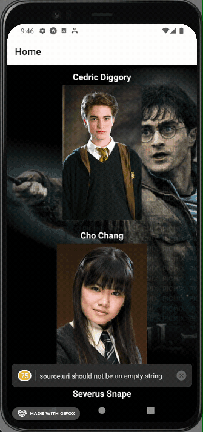

# reactNative_harryPotter

<h1 align="center">Harry Potter API </h1>

  
   
  
  
  
   
  <a href="https://docs.expo.dev/eas">
<picture>
  <source media="(prefers-color-scheme: dark)" srcset="https://img.shields.io/badge/Build-fff.svg?style=for-the-badge&logo=EXPO&labelColor=fff&logoColor=000">
  
</picture>
</a>
 

## Gallery / Cool things

| My First App  
| ------------------------- |

-  package installer: yarn
-  Environment: React Native + Expo
-  Language: Javascript

| Home                         |          Ravenclaw          |
| ---------------------------- | :-------------------------: |
|  |  |

| Hufflepuff                  |          Slytherin          |
| --------------------------- | :-------------------------: |
|  |  |

## Demo links

The JavaScript bundle can be run in the [Expo Go](https://expo.dev/expo-go) app.

